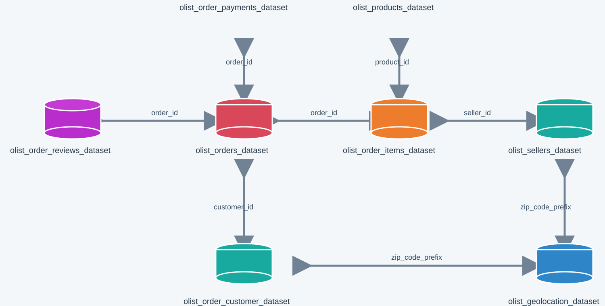

# Target Brazil E-Commerce Analysis

SQL-based analysis of the Brazilian e-commerce dataset to answer business questions related to orders, customers, sales, freight, delivery performance, and payments.

> **Case study basis:** The supplied Target problem statement asks for exploratory analysis, order trends, geography, economic impact, delivery performance, payment behavior, and actionable recommendations. A readable version is preserved in `docs/Target_Problem_Statement.md`.

## Project objective

Act as a data analyst/scientist supporting Target's Brazil e-commerce operations. The goal is to extract useful insights from the Olist dataset and translate the SQL results into concise, evidence-based business recommendations.

## Dataset

This project uses the **Brazilian E-Commerce Public Dataset by Olist**.

The schema covers:

- Customers
- Orders
- Order items
- Payments
- Products
- Sellers
- Reviews
- Geolocation

### Schema



The schema diagram shows the main relationships:

`customers → orders → order_items → products`

`orders → payments`

`orders → order_reviews`

`order_items → sellers → geolocation`

`customers → geolocation`

## Repository structure

```text
Target-Ecommerce-Analysis/
│
├── README.md
├── .gitignore
│
├── data/
│   └── README.md
│
├── docs/
│   └── Target_Problem_Statement.md
│
├── schema/
│   └── schema.svg
│
├── sql/
│   ├── 01_exploratory_analysis.sql
│   ├── 02_order_analysis.sql
│   ├── 03_geographical_analysis.sql
│   ├── 04_economic_analysis.sql
│   ├── 05_delivery_analysis.sql
│   └── 06_payment_analysis.sql
│
└── results/
    └── README.md
```

## SQL analysis

### 1. Exploratory analysis

- Inspect the data types of the `customers` table.
- Find the earliest and latest order purchase timestamps.
- Count distinct cities and states represented by customers who ordered during the requested period.

### 2. In-depth exploration

- Measure yearly order growth.
- Identify monthly seasonality.
- Determine whether customers order more frequently during dawn, morning, afternoon, or night.

Time buckets from the case study:

| Hours | Period |
|---|---|
| 00:00–06:00 | Dawn |
| 07:00–12:00 | Morning |
| 13:00–18:00 | Afternoon |
| 19:00–23:00 | Night |

### 3. E-commerce evolution by geography

- Month-on-month order volume by state.
- Customer distribution across states.

### 4. Economic impact

- Percentage increase in order cost from January–August 2017 to January–August 2018.
- Total and average item price by state.
- Total and average freight value by state.

### 5. Delivery performance

- Delivery time for every delivered order.
- Difference between actual and estimated delivery date.
- Top/bottom five states by average freight.
- Top/bottom five states by average delivery time.
- Five states where delivery is furthest ahead of the estimated date.

A negative `diff_estimated_delivery` means the order arrived earlier than estimated.

### 6. Payment analysis

- Month-on-month order volume by payment type.
- Number of orders by payment installment count.

## How to reproduce

### Step 1 — Download the Olist dataset

Download the eight CSV files from the original public Olist dataset source.

Do **not** commit the raw CSV files to GitHub unless you have a specific reason to do so. The repository `.gitignore` excludes them by default.

### Step 2 — Create a BigQuery dataset

Create a dataset, for example:

```text
Project_SQL
```

Load the CSV files as tables:

```text
customers
orders
order_items
payments
order_reviews
products
sellers
geolocation
```

If you keep the original Olist table name `order_payments`, either rename it to `payments` or change the SQL references accordingly.

### Step 3 — Run the SQL scripts

Run the scripts in this order:

1. `sql/01_exploratory_analysis.sql`
2. `sql/02_order_analysis.sql`
3. `sql/03_geographical_analysis.sql`
4. `sql/04_economic_analysis.sql`
5. `sql/05_delivery_analysis.sql`
6. `sql/06_payment_analysis.sql`

### Step 4 — Export the results

Export the query results and place them in the corresponding `results/` directory.

Example:

```text
results/
└── 05_delivery_analysis/
    ├── delivery_time.csv
    ├── highest_freight_states.csv
    ├── lowest_freight_states.csv
    └── delivery_vs_estimate.csv
```

### Step 5 — Add interpretation

Do not stop at the SQL output. For each question, document:

**Finding → Interpretation → Business implication → Recommendation**

Recommendations should be directly supported by the query results.

## Business questions

The case study asks questions around:

1. Dataset structure and time range
2. Order growth and seasonality
3. Customer ordering time
4. State-level order evolution
5. Customer distribution
6. Order cost growth
7. Price and freight by state
8. Delivery time and delivery accuracy
9. Highest/lowest freight states
10. Highest/lowest delivery-time states
11. Fastest delivery relative to estimates
12. Payment-type trends
13. Payment-installment behavior

## Skills demonstrated

- SQL querying
- BigQuery `INFORMATION_SCHEMA`
- Multi-table joins
- Aggregation and grouping
- Date/time analysis
- `CASE` expressions
- Window functions
- E-commerce analytics
- Geographic analysis
- Logistics and delivery analysis
- Payment behavior analysis
- Business interpretation
- Data-driven recommendations

## Important note on the queries

The supplied problem statement asks for **counts** of cities and states during the given period. The repository's exploratory SQL therefore includes a count query as the primary answer and keeps the detailed city/state query as an optional view.

## Source material

The supplied problem statement and schema are represented in the repository as:

- `docs/Target_Problem_Statement.md`
- `schema/schema.svg`
